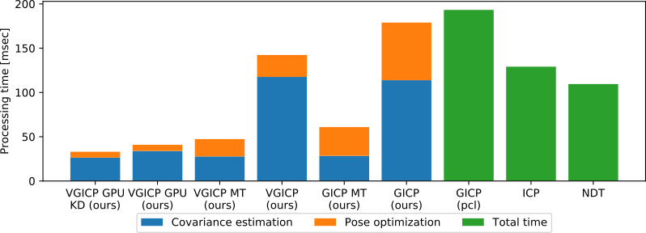

# fast_gicp

This package is a collection of GICP-based fast point cloud registration algorithms. It constains a multi-threaded GICP as well as multi-thread and GPU implementations of our voxelized GICP (VGICP) algorithm. All the implemented algorithms have the PCL registration interface so that they can be used as an inplace replacement for GICP in PCL.

- FastGICP: multi-threaded GICP algorithm (**\~40FPS**)
- FastGICPSingleThread: GICP algorithm optimized for single-threading (**\~15FPS**)
- FastVGICP: multi-threaded and voxelized GICP algorithm (**\~70FPS**)
- FastVGICPCuda: CUDA-optimized voxelized GICP algorithm (**\~120FPS**)


[](https://travis-ci.org/SMRT-AIST/fast_gicp) on melodic & noetic

## Installation

### Dependencies
- PCL
- Eigen
- [Sophus](https://github.com/strasdat/Sophus)
- [nvbio](https://github.com/NVlabs/nvbio)
- OpenMP (optional)
- CUDA (optional)

We have tested this package with Ubuntu 18.04, ROS melodic, and CUDA 10.2.

### CUDA

To enable CUDA-based features, uncomment ```find_package(CUDA)``` in ```CMakeLists.txt```.

### ROS
```bash
cd ~/catkin_ws/src
git clone https://github.com/SMRT-AIST/fast_gicp --recursive
cd .. && catkin_make -DCMAKE_BUILD_TYPE=Release
```

### Non-ROS
```bash
git clone https://github.com/SMRT-AIST/fast_gicp --recursive
cd fast_gicp && git checkout non_ros
mkdir build && cd build
cmake .. -DCMAKE_BUILD_TYPE=Release
make -j8
```

## Benchmark
CPU:Core i9-9900K GPU:GeForce RTX2080Ti

```bash
roscd fast_gicp/data
rosrun fast_gicp gicp_align 251370668.pcd 251371071.pcd
```

```
target:17249[pts] source:17249[pts]
--- pcl_gicp ---
single:116.098[msec] 100times:11157.4[msec]
--- pcl_ndt ---
single:168.511[msec] 100times:15957.2[msec]
--- fgicp_st ---
single:106.775[msec] 100times:10525.3[msec] 100times_reuse:6719.9[msec]
--- fgicp_mt ---
single:39.8451[msec] 100times:3159.26[msec] 100times_reuse:2279.86[msec]
--- vgicp_st ---
single:111.046[msec] 100times:8228.94[msec] 100times_reuse:4354.57[msec]
--- vgicp_mt ---
single:23.0753[msec] 100times:2345.63[msec] 100times_reuse:1381.06[msec]
--- vgicp_cuda (parallel_kdtree) ---
single:16.3572[msec] 100times:1585.69[msec] 100times_reuse:783.953[msec]
--- vgicp_cuda (gpu_bruteforce) ---
single:47.8433[msec] 100times:3235.27[msec] 100times_reuse:1582.99[msec]
```

See [src/align.cpp](https://github.com/SMRT-AIST/fast_gicp/blob/master/src/align.cpp) for the detailed usage.

## Test on KITTI

```bash
# Perform frame-by-frame registration
rosrun fast_gicp gicp_kitti /your/kitti/path/sequences/00/velodyne
```


## Related packages
- [ndt_omp](https://github.com/koide3/ndt_omp)
- [fast_gicp](https://github.com/SMRT-AIST/fast_gicp)


## Papers
<<<<<<< HEAD
If you use this package, please cite the following paper:
- Kenji Koide, Masashi Yokozuka, Shuji Oishi, and Atsuhiko Banno, Voxelized GICP for fast and accurate 3D point cloud registration, 16th Intelligent Autonomous Systems Conference (IAS16) (under review). [[link]](https://easychair.org/publications/preprint/ftvV)
=======
If you use this package, please cite the following paper:  
- Kenji Koide, Masashi Yokozuka, Shuji Oishi, and Atsuhiko Banno, Voxelized GICP for fast and accurate 3D point cloud registration [[link]](https://easychair.org/publications/preprint/ftvV)
>>>>>>> ff50fd65b79fa49351e2b44ebd5f9d6a337a7090

## Contact
Kenji Koide, k.koide@aist.go.jp

Robot Innovation Research Center, National Institute of Advanced Industrial Science and Technology, Japan  [\[URL\]](https://unit.aist.go.jp/rirc/en/team/smart_mobility.html)
